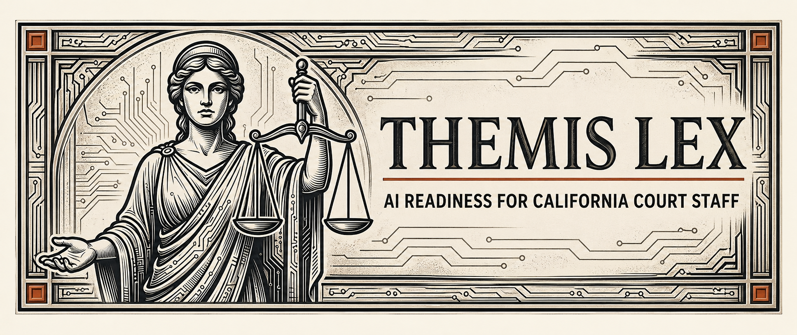

# Themis Lex

> *Court-admissible AI guidance. Built for the people who run the courts.*

An AI readiness self-check tool built specifically for California Superior Court staff. A court employee enters their role, describes their workflow, picks a data sensitivity level, and gets back two things: where AI can safely help them, and where AI must never touch their work. The output downloads as a PDF the employee can hand directly to their supervisor.

No accounts. No login. No data stored. Stateless by design.

**🔗 Live demo:** https://themislex.org

**Status:** ✅ Deployed to AWS Amplify | ✅ Bedrock Claude Haiku 4.5 active | ✅ Server-side PDF generation | ✅ IAM compute role auth | ✅ 6-gotcha AWS deployment survived

---

## Why this exists

I work in California courts. I'm a Judicial Services Manager at Santa Barbara Superior Court. My day job is the same data my product is built to protect: case parties, witnesses, victims, jurors, sealed records, personnel files. Some of the most regulated information in the state runs through court staff hands every day.

Every think piece this year tells my colleagues we should be using AI. None of them mention what we actually handle. Generic AI guidance assumes a marketing team or a software engineer. It doesn't fit the legal, ethical, or chain-of-custody context that defines court work.

So I built the thing I wished existed when I sat down at my desk. Themis Lex is the AI readiness check I would have wanted on day one.

Built solo over three weeks for the Women in AI Accelerator (Spring 2026 Build Challenge).

---

## What it is

Three short inputs. One structured output. Zero stored data.

1. **Pick your role.** Three California Superior Court classifications supported in v1: Judicial Assistant I/II, Judicial Assistant III Courtroom, Judicial Services Supervisor/Sr.
2. **Describe your workflow.** In your own words. 120 characters minimum. The longer and more specific, the better the guidance.
3. **Pick your data sensitivity level.** Low (public filings, scheduling), Medium (internal, non-sealed), High (sealed, minors, PII).

Themis Lex returns two columns, side by side:

- **Where AI Can Help You.** 3 to 5 role-specific workflows. Each one includes a description, why it's safe, and plain-language guardrails (not "redact PII", but "don't paste case numbers or party names into the AI").
- **Where AI Must Not Touch.** 3 to 5 role-specific restrictions. Each one includes the rule, the risk if you violate it, and a human alternative.

Output downloads as a PDF. Hand it to your supervisor. Keep it for your records. Print it for your team.

---

## How it works

```
User arrives → Pick role + describe workflow + pick sensitivity
     ↓
Server-side: role context + governance principles + workflow
silently combined into a single Bedrock prompt
     ↓
Claude Haiku 4.5 returns structured JSON:
{ can_help: [...], must_not_touch: [...] }
     ↓
Two-column UI renders results
     ↓
Server-side PDF generation via @react-pdf/renderer
     ↓
User downloads PDF, session ends, nothing stored
```

The "magic" is in the prompt assembly layer. Three documents combine on every request:

- **Court context** — California judicial branch AI governance principles. Never changes. Injected as system prompt.
- **Role context** — The actual public job description for the user's selected classification, extracted from Santa Barbara Superior Court bulletins. Tells the model what a Judicial Assistant III Courtroom *actually does* (takes minutes, administers oaths, maintains custody of evidence) so the output stops at generic.
- **User input** — The user's own description of their workflow, wrapped in XML delimiters and treated as data, not instructions.

The user never sees this layer. The output reads as plain advice from a thoughtful supervisor.

---

## What it produces

The PDF artifact is the actual deliverable of Themis Lex. It's what court employees use the tool to generate, not a marketing afterthought.

Each PDF includes a branded header (Lady Justice + circuit-board motif), metadata (role, data sensitivity, generation date), the two-column assessment with all 6-10 cards (3-5 per side), a disclaimer, and pagination. Rendered with Inter for body and Source Serif 4 for headings, on cream paper. Designed to look like something you'd hand to a senior judicial officer without apologizing.

A sample assessment for a Judicial Assistant III Courtroom at High sensitivity returns workflows like "Case Preparation Notes and Procedural Checklists" (with the guardrail "Use generic placeholders like 'Case Type: Misdemeanor DUI', not real case numbers") on the can-help side, and "Evidence Custody Records" (with the rule "Chain of custody records must maintain an unbroken, auditable trail of custody. AI cannot participate") on the must-not-touch side.

---

## Architecture

Stateless serverless on AWS Amplify Hosting. No database. No accounts. No session storage. Single API call per assessment.

```
┌──────────────────┐
│    Next.js 14    │
│   (Amplify SSR)  │
│                  │
│  app/ — page UI  │
│  pages/api — RT  │
└────────┬─────────┘
         │
         ├─────────────────┐
         │                 │
         ▼                 ▼
┌─────────────────┐  ┌─────────────────┐
│  /api/assess    │  │   /api/pdf      │
│                 │  │                 │
│  validate       │  │  validate       │
│  rate-limit     │  │  rate-limit     │
│  assemble prompt│  │  render PDF     │
│  stream Bedrock │  │  stream bytes   │
└────────┬────────┘  └────────┬────────┘
         │                    │
         ▼                    ▼
┌─────────────────┐  ┌─────────────────┐
│  AWS Bedrock    │  │ @react-pdf/     │
│  Claude Haiku   │  │  renderer       │
│      4.5        │  │  (server-side)  │
└─────────────────┘  └─────────────────┘
```

### Key decisions

| Decision | Choice | Why |
| --- | --- | --- |
| Frontend framework | Next.js 14 (App Router page, Pages API routes) | Familiar SSR with simple deployment story |
| Model | Claude Haiku 4.5 via Bedrock | Fast (~14s) inside Amplify's 28-30s gateway timeout; Sonnet 4.6 was ~42s and would not fit |
| Auth | IAM compute role attached at branch level | AWS-recommended pattern, no long-lived credentials in env vars |
| Hosting | AWS Amplify Hosting (SSR Compute mode) | $10K AWS hackathon credits available; explicitly chosen over Vercel for the credits |
| PDF generation | `@react-pdf/renderer` server-side | No client-side canvas, no jsPDF, deterministic output |
| Rate limiting | In-memory token bucket per IP | 5/min for assess, 10/min for pdf; stub for shared backend in V2 |
| Security headers | next.config.js with CSP-Report-Only | Honest distinction between learning posture and enforcement |
| State storage | None | Stateless by design; sessions end at PDF download |

---

## Project structure

```
themis-lex/
├── app/                            # Next.js App Router (page UI)
│   ├── page.tsx                    # Single-page application
│   ├── layout.tsx                  # Root layout + font loading
│   └── globals.css                 # Design tokens + responsive styles
├── components/                     # React components, one responsibility each
│   ├── AssessmentForm.tsx          # Role + workflow + sensitivity inputs
│   ├── ResultsPanel.tsx            # Two-column results + PDF download trigger
│   ├── WorkflowCard.tsx            # Individual card (help + notouch variants)
│   ├── EmptyState.tsx              # Default state before assessment
│   ├── LoadingState.tsx            # During API call (rotating messages)
│   └── ErrorState.tsx              # Error display with retry
├── pages/api/                      # Pages API routes (server-side)
│   ├── assess.ts                   # POST: validate, prompt, stream Bedrock
│   └── pdf.ts                      # POST: validate, render PDF, stream bytes
├── lib/
│   ├── bedrock.ts                  # AWS SDK wrapper, streaming Bedrock client
│   ├── prompt.ts                   # System + user prompt assembly
│   ├── validate.ts                 # Server-side input validation
│   ├── pdf.ts                      # @react-pdf/renderer document
│   └── rateLimit.ts                # In-memory token bucket
├── data/
│   ├── role_context.json           # Extracted job descriptions per role
│   └── source-pdfs/                # Original job description PDFs
├── public/                         # Static assets (fonts, banner, favicon)
├── skills/
│   └── amplify-hosting-deployment-prep/  # Claude skill capturing AWS gotchas
├── themis-lex-prd-v1_3.md          # Locked product requirements
├── themis-lex-prompt-spec.md       # Prompt assembly specification
├── DEPLOY.md                       # Deployment, env vars, IAM, smoke test
├── dev-to-article-amplify-gotchas.md  # Article draft for dev.to
├── amplify.yml                     # Amplify build spec
├── next.config.js                  # Security headers + env inlining
└── README.md                       # You are here
```

This is intentional. One file, one responsibility. No god files. Every file's job is in its docstring at the top.

---

## Heads up: AWS Amplify Hosting + Bedrock gotchas

If you're forking this project to deploy your own version, there are six AWS gotchas that cost me a full day of debugging. AWS docs underspecify all of them. Hopefully this saves you the same time.

### Gotcha 1: The trust policy needs two principals, not one

Most AWS docs for Amplify SSR compute roles show this trust policy:

```json
{
  "Version": "2012-10-17",
  "Statement": [{
    "Effect": "Allow",
    "Principal": { "Service": "amplify.amazonaws.com" },
    "Action": "sts:AssumeRole"
  }]
}
```

That's only enough for the build service to assume the role. The runtime Lambda that serves your API routes runs as `lambda.amazonaws.com` and needs to be on the trust list too. Use this:

```json
{
  "Version": "2012-10-17",
  "Statement": [{
    "Effect": "Allow",
    "Principal": {
      "Service": ["amplify.amazonaws.com", "lambda.amazonaws.com"]
    },
    "Action": "sts:AssumeRole"
  }]
}
```

**Symptom if you miss this:** API routes hang for exactly 28 seconds, then Lambda kills the request with "Request timed out." No error logged from your code, because the AWS SDK never reaches your service. It's stuck in the credential provider chain looking for a role it can't assume.

**Related coding trap worth knowing about:** if your SDK client code passes an explicit `credentials:` object even with empty string values, the AWS SDK disables the credential provider chain entirely and tries to sign requests with those empty strings. Result is a silent hang identical to the trust policy bug.

```typescript
// WRONG — disables the provider chain
new BedrockRuntimeClient({
  region: process.env.AWS_REGION,
  credentials: {
    accessKeyId: process.env.AWS_ACCESS_KEY_ID || '',
    secretAccessKey: process.env.AWS_SECRET_ACCESS_KEY || '',
  },
});

// CORRECT — uses provider chain, picks up compute role creds at runtime
new BedrockRuntimeClient({
  region: process.env.AWS_REGION,
});
```

Omit the `credentials` object entirely when using IAM compute roles. The SDK's default credential provider chain handles both local dev (reading from `.env.local`) and production (from the Lambda runtime's STS-assumed role) automatically.

### Gotcha 2: Attach the compute role at the BRANCH level, not just the app level

Amplify Console has two places to attach a compute role:

1. App settings > IAM roles > Compute role > **Default role** (app-level)
2. App settings > IAM roles > Compute role > **Branch overrides** (per-branch)

The "Default role" only applies to the build environment (CodeBuild). The runtime Lambda that serves your traffic only picks up the role from a branch-level attachment. Set it on every branch you intend to deploy.

Verify via CLI:

```bash
aws amplify get-app --app-id YOUR_APP_ID
aws amplify get-branch --app-id YOUR_APP_ID --branch-name main
```

If `computeRoleArn` shows on the app but not on the branch, you've hit this gotcha. Fix:

```bash
aws amplify update-branch \
  --app-id YOUR_APP_ID \
  --branch-name main \
  --compute-role-arn arn:aws:iam::YOUR_ACCOUNT:role/YOUR_ROLE_NAME
```

Symptom is the same as Gotcha 1: 28-second hang on API routes, no error logged.

### Gotcha 3: Environment variables don't reach the SSR Lambda runtime

You set `BEDROCK_MODEL_ID` (or any non-`AWS_`-prefixed env var) in Amplify Console > App settings > Environment variables. The build picks it up fine. At runtime, `process.env.BEDROCK_MODEL_ID` is `undefined`. Same value, set in the same place, available during `npm run build`, missing inside the running Lambda.

Amplify environment variables flow into the BUILD environment (CodeBuild) but are not automatically injected into the SSR Lambda's runtime. Vercel, Railway, Render, and most other hosting platforms make env vars available at both. Amplify's split between build and runtime is a real platform difference.

**Fix:** tell Next.js to bake the value into the server bundle at build time. In `next.config.js`:

```js
const nextConfig = {
  env: {
    BEDROCK_MODEL_ID: process.env.BEDROCK_MODEL_ID,
    // any other server-side env vars you need at runtime
  },
};
```

**Symptom if you miss this:** API routes work locally with `npm run dev` (env reads from `.env.local`) but fail in production with errors like `BEDROCK_MODEL_ID is undefined`, or the production app silently uses a code-level fallback default instead of the value you set in Amplify Console.

### Gotcha 4: Bedrock requires AWS Marketplace permissions on the IAM policy

Even after granting `bedrock:InvokeModel` on the right resources, your Bedrock call may fail with `AccessDeniedException` mentioning Marketplace actions.

Since September 2025, Bedrock auto-enables models on first call. The auto-enable runs through AWS Marketplace silently and requires the calling IAM principal to have permission to view and subscribe to Marketplace listings. The old Bedrock Console "Model access" page where you manually opted in is retired.

**Fix:** add these to your IAM policy alongside the existing Bedrock actions:

```json
{
  "Effect": "Allow",
  "Action": [
    "aws-marketplace:ViewSubscriptions",
    "aws-marketplace:Subscribe"
  ],
  "Resource": "*"
}
```

**Symptom if you miss this:** `AccessDeniedException` with a message about Marketplace actions, not Bedrock actions.

### Gotcha 5: Amplify SSR Lambdas have a 28-second hard timeout that cannot be raised

After fixing both auth issues above, you might still see API routes time out at exactly 28 seconds. Amplify Hosting SSR Lambdas have a 28-second invocation timeout that cannot be increased.

This is tracked as an open issue on aws-amplify/amplify-hosting since January 2023 (issue #3223). It has 59+ thumbs-up and no announced fix as of this writing.

For Bedrock specifically, large prompts that produce multi-item structured JSON outputs can routinely exceed 30 seconds. My calls were hitting around 42 seconds at `max_tokens=6000` on Claude Sonnet 4.6.

**Fix:** reduce upstream response time below 25 seconds (drop max_tokens, simplify prompts, switch to a faster model like Claude Haiku 4.5), or move the slow endpoint off Amplify SSR (Lambda Function URL, App Runner, Vercel Pro).

Switching the SDK to streaming responses (`InvokeModelWithResponseStreamCommand`) does NOT solve this on Pages API routes. See Gotcha 6.

### Gotcha 6: Next.js Pages API routes don't truly stream on Amplify Hosting

After implementing the streaming fix from Gotcha 5, you may find your API routes still time out at the gateway. The Lambda is receiving Bedrock chunks correctly via async iteration, your code is calling `res.write(chunk)` for each one, but the gateway still kills the connection.

Next.js Pages API routes buffer the response. The chunks you write via `res.write()` are not flushed to the Amplify gateway in real-time. They sit in Next.js's internal HTTP handling until `res.end()` is called, at which point the full response is serialized and sent at once. By that time, the gateway has already cut the connection.

App Router route handlers using the standard Web `Response` object with a `ReadableStream` body have better streaming behavior, but the gateway timeout still caps total time.

**Fix paths:** reduce response time below the gateway window (this is what Themis Lex does — switched from Sonnet 4.6 at ~42s to Haiku 4.5 at ~14s), or move slow endpoints off Amplify SSR entirely. For LLM-heavy workloads with synchronous structured output, Vercel Pro is generally a better hosting fit.

### Why none of these gotchas appear clearly in the obvious places

All six are documented in scattered AWS GitHub issues, community forum posts, or buried in docs the quickstart pages don't link to. The Amplify Hosting docs cover the build pathway clearly but treat the runtime pathway as an implementation detail. The Bedrock Marketplace requirement appeared after the September 2025 auto-enable change and isn't loudly announced anywhere. You are not the first dev to hit any of these. Just the cost of doing business on Amplify Hosting in Spring 2026.

---

## Stack

| Layer | Technology |
| --- | --- |
| Framework | Next.js 14 (App Router page + Pages API routes) |
| Language | TypeScript |
| LLM | Claude Haiku 4.5 via AWS Bedrock |
| PDF | `@react-pdf/renderer` (server-side) |
| Hosting | AWS Amplify Hosting (SSR Compute mode) |
| Auth | IAM compute role + STS-assumed credentials |
| Rate limiting | In-memory token bucket per IP |
| Security headers | next.config.js with CSP-Report-Only |
| State | None (stateless by design) |

---

## Local development

```bash
npm install
cp .env.example .env.local
# Fill in your AWS access keys and Bedrock model ID
npm run dev
```

For production deployment instructions, IAM compute role setup, environment variable handling, and the 5-item smoke test, see [`DEPLOY.md`](./DEPLOY.md).

---

## Documentation

- [`themis-lex-prd-v1_3.md`](./themis-lex-prd-v1_3.md) — locked product requirements doc
- [`themis-lex-prompt-spec.md`](./themis-lex-prompt-spec.md) — prompt assembly spec (system prompt, role context, sensitivity rules)
- [`DEPLOY.md`](./DEPLOY.md) — deployment, environment variables, IAM compute role setup, smoke test checklist
- [`dev-to-article-amplify-gotchas.md`](./dev-to-article-amplify-gotchas.md) — long-form write-up of the deployment journey
- [`skills/amplify-hosting-deployment-prep/SKILL.md`](./skills/amplify-hosting-deployment-prep/SKILL.md) — captured-knowledge artifact for future Claude sessions

---

## What's next (stubbed)

Shipped today as a focused tool for three California Superior Court classifications. The architecture supports expansion.

- **Additional roles** — Courtroom Clerk, Deputy Clerk, Research Attorney, Family Law Facilitator, Self-Help Center Staff, Court Administrator. Disabled in the role selector with the label "Role context for this classification is pending."
- **Multi-court deployment** — Themis Lex v1 uses Santa Barbara Superior Court job descriptions. V2 supports any California Superior Court that contributes its own role context.
- **Two-call differential temperature** — Split assessment into two Bedrock calls. Call 1 at 0.7 returns `can_help` only. Call 2 at 0.1 returns `must_not_touch` only. Documented in `lib/bedrock.ts` as STUB V2.
- **Nonce-based CSP** — Replace `'unsafe-inline'` with per-request nonces. Documented in `next.config.js` as STUB V2.
- **Shared rate-limit backend** — Replace in-memory token bucket with Upstash Redis or DynamoDB. Documented in `lib/rateLimit.ts` as STUB V2.
- **Move off Amplify SSR for the assessment endpoint** — switch to Lambda Function URL with response streaming enabled so we can run Claude Sonnet 4.6 (the larger model) without the 28-30 second gateway ceiling.

---

## About the Clew suite

Themis Lex is part of a growing suite of small tools that share one thesis: take something invisible and make it inspectable.

- **Janus Clew** — invisible indie-builder growth made measurable
- **Memoria Clew** — invisible research context made transparent
- **Themis Lex** — invisible AI readiness for court staff made explainable
- **Hermes Clew** — invisible agent-readability of websites made scannable
- **README Clew** — invisible README-vs-code drift made surfaceable

Self-taught builders ship faster than they document. AI agents help us write more code than we can keep track of. Public servants are told to "use AI" without anyone telling them which parts are off-limits. We need tools that close the gap between what we say is happening and what is actually happening.

Audit your own receipts.

---

## Development approach

This is an AI-assisted, human-reviewed build. All decisions and mistakes are mine. I used Claude (for architecture and review), Kiro (for builds and AWS deploy work), and other AI tools throughout development. Every output was reviewed, tested, and integrated with full accountability for correctness and alignment.

Built solo over three weeks. Survived six undocumented AWS Amplify gotchas. Shipped despite them.

---

## License

MIT

---

*AI assisted. Human approved. Powered by NLP.*
